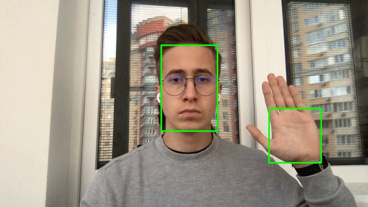

# Dataset

**Annotation example**
<p align="center">

</p>

**split.json format:**

```json
{
  "train":
  [
    ["2-00054.jpg", [[252, 25, 381, 208, 0, 0, -1], [93, 219, 222, 361, 1, 2, 0]]],
  ],
  "val":
  [
    ["5-00006.jpg", [[312, 92, 425, 264, 0, 0, -1]]],
  ],
}
```
<br />

All bounding boxes are presented in `pascal_voc` format: `[[x_min, y_min, x_max, y_max, class, subclass, side]]`

<br />

**class / subclass:**

- 0 - Face
    - 0 - Neutral
    - 1 - Smile
- 1 - Palm _(we labeled a palm only instead of a whole wrist)_
    - 0 - ThumbUp
    - 1 - ThumbDown
    - 2 - HandUp

**side:**

- 0 - Left
- 1 - Right
- -1 - not defined (we ignore this attribute for objects that don't have corresponding labels)
